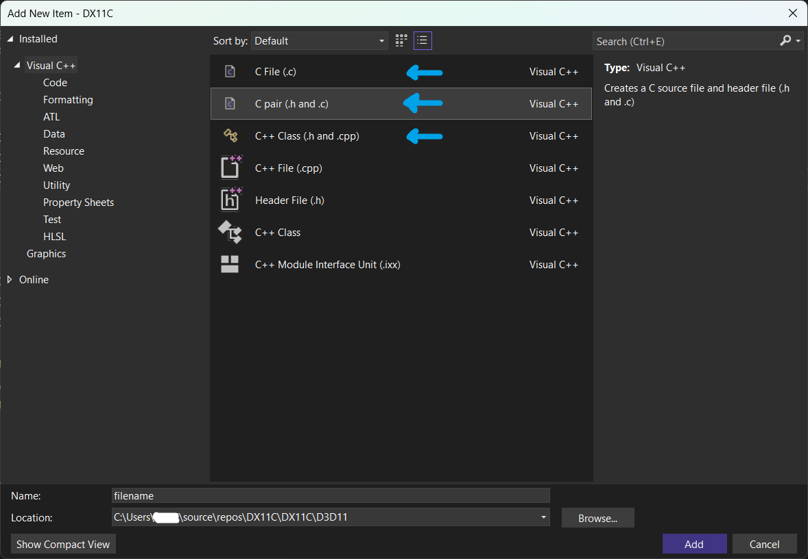
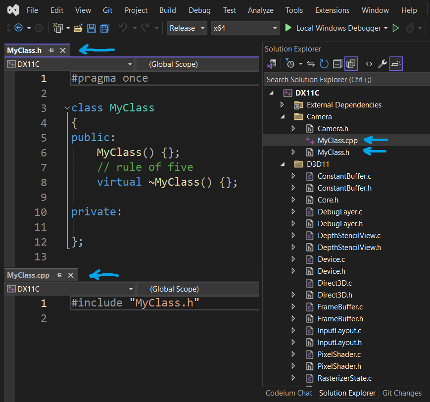

# Visual Studio 2022 - Add New File Templates

Visual Studio add new file templates for streamlining the workflow:
- SourceC:   [C]   For adding a new C-file to your project
- SourceCH:  [C]   For adding both a new C-file and H-file in one go
- SourceCPP: [C++] For adding both a new CPP-file and H-file in one go

Here is an example of adding a typical C++ class (.cpp and .h) into your project:

This reduses a number of steps in order to accomplish this typical task. What I really like with this is that you can customize your own files, in this example you can use $safeitemname$ to insert your class name instead of having to do this manually by replacing it with MyClass.

INSTALLATION:
- Follow the installation instructions in the "HowToAddNewItem-In-VisualStudio2022.txt" file.

TODO:
- Implement the Rule of Five in SourceCPP.
